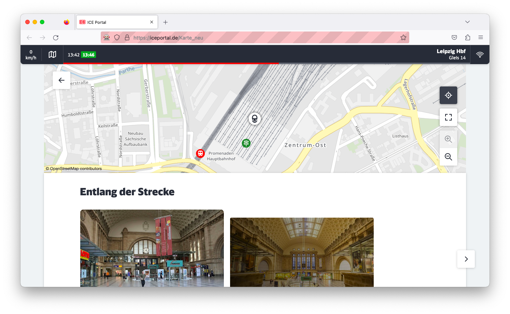
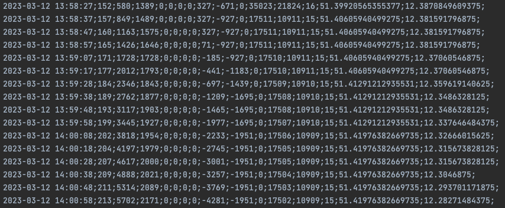
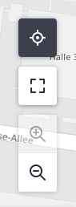
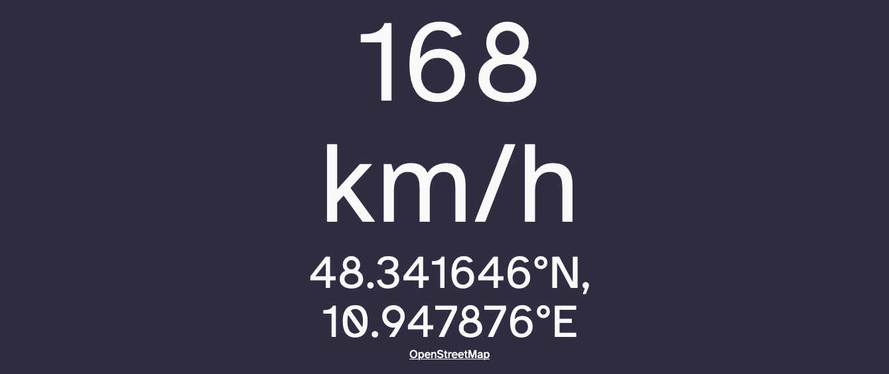
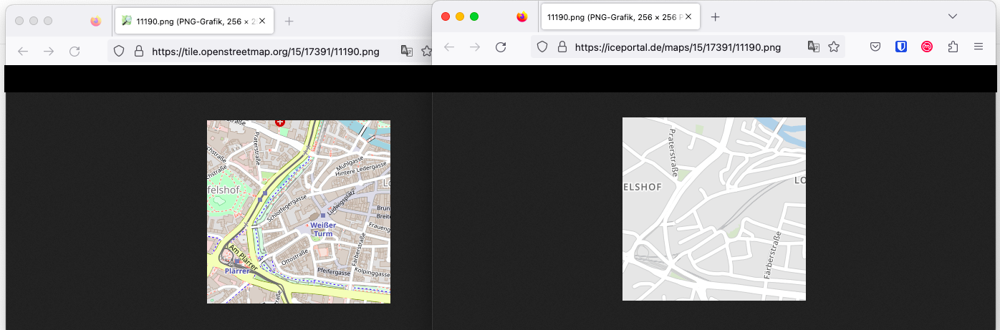

# README

The Python script `extract.py` extracts the current GPS position and train speed (in km/h) from the map publicly accessible in **Deutsche Bahn's ICE Portal**, hence the name of the repository. It works when being connected to the train's WiFi but independent of your device's position sensor. The data is parsed periodically (every 10 seconds) and stored to a CSV file for further analysis.

⬇️

To improve precision of GPS coordinates, zoom to the maximum zoom level by pressing the magnifying glass symbol.

You can also run the second Python script `serve.py` using Flask (`flask --app serve run`) in addition. It will serve the extracted data on your own website from the latest logged CSV data:

## How does it work?

This script automatically opens the Firefox web browser at https://iceportal.de/Karte_neu and automatically scrapes the train's speed and GPS position. Deutsche Bahn uses OpenStreetMap in the background. The same URL [slippy map tilenames](https://wiki.openstreetmap.org/wiki/Slippy_map_tilenames) format is used for the tile URLs:

The GPS coordinates as latitude and longitude in degrees are re-calculated from the dynamically loaded map tiles' URLs. There's no overhead in communication added by this script - so no additional queries, just using the available data from the browser.

The scraping is done using [Selenium WebDriver](https://www.selenium.dev/documentation/webdriver/) for Firefox. The elements are specified using [XPath syntax](https://www.w3schools.com/xml/xpath_syntax.asp) *(and is subject to change as soon as Deutsche Bahn decides to change their content layout)*.

The script also stores some 3D transformation positions that could be used to add precision to the GPS coordinates by using the extracted values for correction.

## Prerequisites

* Working Python3 environment with the Selenium module installed.
* Have Firefox web browser installed *(script can likely be rewritten for other web browsers)*.
* Be on a Deutsche Bahn ICE or Intercity (long-distance) train on your way across Germany.
* Manually connect to WiFi
with "WIFIonICE" and browse to "ICEportal.de" in your web browser.

## Future ideas

You could also ...

* extract and store internet connectivity status and forecast along your journey.
* extract and store shown delays in scheduled arrival times along your journey.
* add a quick check-in function for [Träwelling](https://traewelling.de/about).
